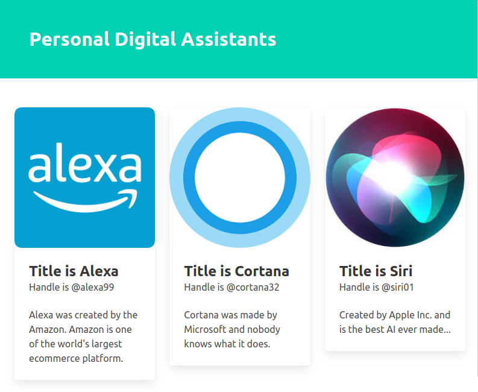

# PDAS (Personal Digital Assistants)

This is a simple react project where some cotents are put into JSX and presented to the user. Basically, the name PDA is because of the components presented are showing card components with the name of the Alexa, Siri, etc.

This project can be tested as follows:

1. Clone this repo...
2. `cd` into the directory pdas.
3. Install the dependencies by `npm install`.
4. Run `npm start`

# Pics API

This is a simple image search project where user can search images by adding the key term in the search field and hitting enter. The project used Usplash API and State Management through `useState` hook. This project can be tested as follows:

1. Clone this repo...
2. `cd` into the directory pics-api.
3. Install the dependencies by `npm install`.
4. If have an account on Unsplash then create an App and get the Client-ID and put it in the `api.js` file in the following way:
  `'Client-ID <Your Client Id>'`
4. Run `npm start`

./assets/pics-api.mp4